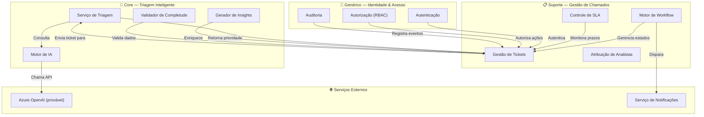
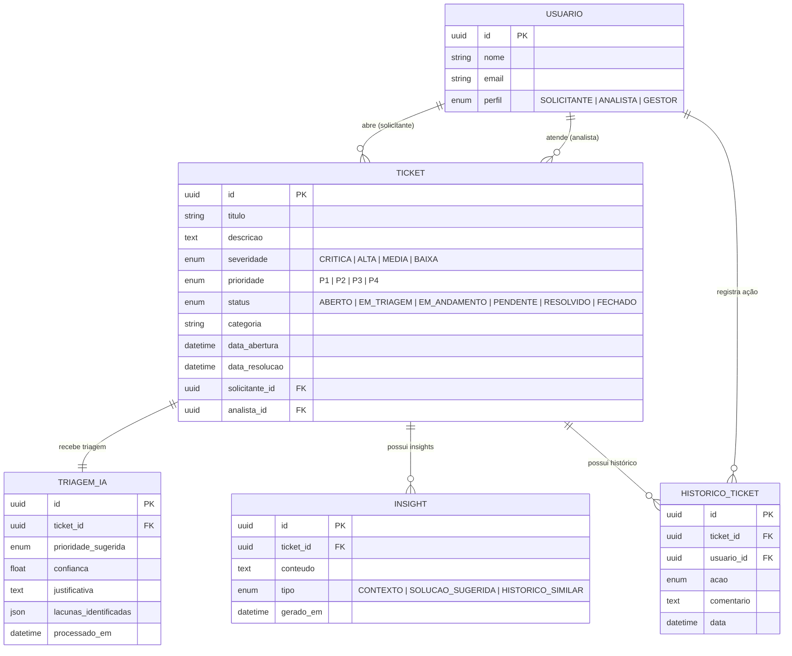

# 🔍 Análise de Domínio — AvanDesk-AI

## 1. Visão Geral do Domínio

O **AvanDesk-AI** opera no domínio de **Gestão de Suporte Técnico (IT Service Management — ITSM)**, focando no ciclo de vida de chamados (tickets) para aplicações globais.

O problema central atacado é:

> Chamados abertos com dados incompletos e triagens puramente manuais geram ruído de comunicação e aumentam o tempo de resposta a incidentes em ambientes corporativos globais.

---

## 2. Subdomínios

### 2.1 Subdomínio Core — Triagem Inteligente

O diferencial competitivo da plataforma. Responsável por:

- Análise automática da severidade do chamado com IA.
- Sugestão de nível de prioridade com base no impacto relatado.
- Geração de insights contextuais para auxiliar a investigação do analista.
- Validação de completude dos dados inseridos no ticket.

### 2.2 Subdomínio de Suporte — Gestão de Chamados

Funcionalidades operacionais essenciais que sustentam o core:

- Abertura, edição e fechamento de chamados.
- Fluxo de status (workflow) do ticket.
- Atribuição e reatribuição de chamados a analistas.
- Histórico de interações e SLA tracking.

### 2.3 Subdomínio Genérico — Identidade & Acesso

Capacidades que não são diferencial, mas são necessárias:

- Autenticação e autorização de usuários.
- Gestão de perfis e permissões (RBAC).
- Auditoria de ações.

---

## 3. Glossário Ubíquo (Ubiquitous Language)

| Termo | Definição |
|-------|-----------|
| **Ticket (Chamado)** | Registro formal de um incidente, problema ou solicitação de suporte. |
| **Solicitante** | Usuário que abre o ticket relatando o problema. |
| **Analista** | Profissional de suporte responsável por investigar e resolver o ticket. |
| **Gestor** | Responsável pela equipe de suporte; monitora métricas, SLAs e distribuição de carga. |
| **Triagem** | Processo de avaliação inicial de um ticket para determinar prioridade e categoria. |
| **Severidade** | Grau de impacto técnico do incidente no sistema ou operação. |
| **Prioridade** | Ordem de atendimento definida pela combinação de severidade + urgência de negócio. |
| **SLA (Service Level Agreement)** | Acordo de nível de serviço que define prazos máximos de resposta e resolução. |
| **Categoria** | Classificação temática do ticket (ex.: Infraestrutura, Aplicação, Rede). |
| **Escalonamento** | Transferência do ticket para um nível de suporte superior (N1 → N2 → N3). |
| **Insight Contextual** | Informação gerada pela IA para apoiar a investigação do analista. |
| **Lacuna de Contexto** | Dado essencial ausente no registro do ticket, identificado automaticamente pelo sistema. |
| **Resolução** | Registro da solução aplicada e encerramento do ticket. |
| **Base de Conhecimento** | Repositório de soluções documentadas para problemas recorrentes. |

---

## 4. Mapa de Contexto (Context Map)

---

## 5. Entidades de Domínio Principais

---

## 6. Regras de Negócio Principais

| ID | Regra |
|----|-------|
| RN-01 | Todo ticket deve ter no mínimo: título, descrição e categoria preenchidos antes de ser submetido. |
| RN-02 | A triagem automática deve ser executada imediatamente após a criação do ticket. |
| RN-03 | A prioridade sugerida pela IA pode ser aceita ou sobrescrita pelo analista. |
| RN-04 | Lacunas de contexto identificadas devem ser comunicadas ao solicitante para complementação. |
| RN-05 | O SLA começa a contar a partir da atribuição do ticket a um analista. |
| RN-06 | Escalonamento automático deve ocorrer quando o SLA estiver em risco de ser violado. |
| RN-07 | Toda resolução deve ser documentada para alimentar a base de conhecimento. |
| RN-08 | O sistema deve manter rastreabilidade completa (auditoria) de todas as mudanças de estado do ticket. |
