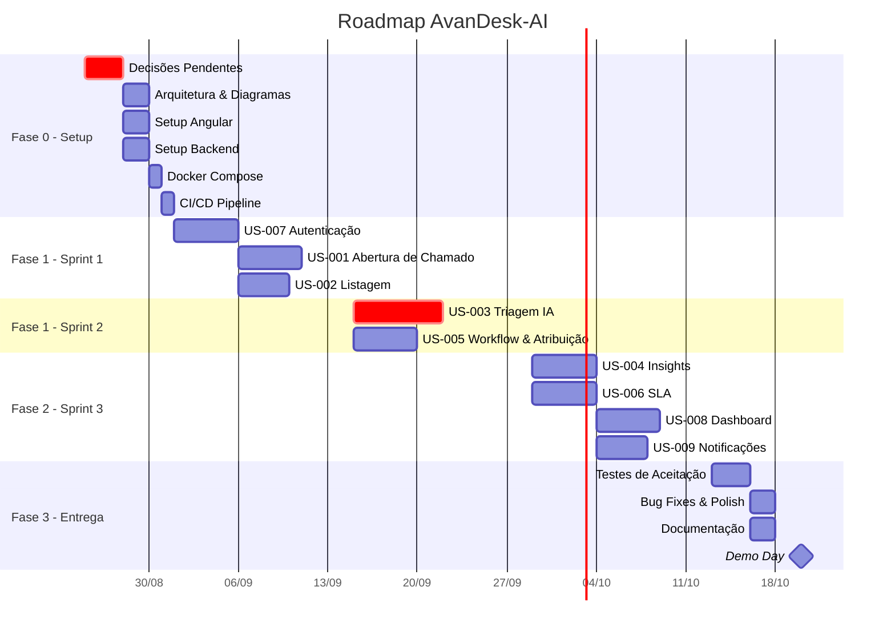

# 🚀 Próximos Passos — AvanDesk-AI

## Status Atual

| Item | Status |
|------|:------:|
| Repositório GitHub | ✅ Criado |
| Documentação de Domínio | ✅ Concluída |
| Requisitos Funcionais | ✅ Refinar |
| Requisitos Não Funcionais | ✅ Refinar |
| User Stories & Tasks | ✅ Refinar |
| Definição de Stack Backend | ⏳ Aguardando definição |
| Definição de Serviço de IA | ⏳ Aguardando definição |
| Início do Desenvolvimento | ⏳ Pendente |

---

## 🔴 Pontos de Decisão Pendentes

Estas decisões impactam diretamente a arquitetura e devem ser resolvidas **antes** do início do desenvolvimento:

### 1. Stack Backend

| Opção | Prós | Contras |
|-------|------|---------|
| **Java + Spring Boot** | Ecossistema Avanade/Microsoft-friendly, robustez enterprise, forte tipagem | Verbosidade, curva de aprendizado |
| **C# + ASP.NET Core** | Alinhado ao ecossistema Azure/Avanade, performance excelente, integração nativa com Azure | Equipe precisa dominar C# |
| **Node.js + NestJS** | Mesma linguagem do frontend (TypeScript), rápido prototipagem | Menos robusto para processamento pesado |
| **Python + FastAPI** | Excelente para IA/ML, async nativo, rápido | Pode não se alinhar ao stack corporativo |

> **Recomendação:** Aguardar definição da Avanade. C# + ASP.NET Core é o candidato natural dado o ecossistema.

### 2. Serviço de IA para Triagem

| Opção | Prós | Contras |
|-------|------|---------|
| **Azure OpenAI Service** | Ecossistema Azure, compliance corporativo, SLA enterprise | Custo por token, dependência de cota |
| **Azure AI Services (Cognitive)** | Serviços prontos (Text Analytics, Language Understanding) | Menos flexível que LLM para triagem |
| **Modelo customizado** | Controle total, sem custo recorrente de API | Requer dados de treino, expertise em ML |

> **Recomendação:** Azure OpenAI Service (GPT-4o) — melhor fit para análise semântica de texto e geração de insights. Encapsular em adapter pattern para permitir troca futura.

### 3. Estratégia de Deploy

| Opção | Prós | Contras |
|-------|------|---------|
| **Azure Container Apps** | Serverless containers, auto-scaling, integração nativa Azure | Custo pode ser imprevisível |
| **Azure App Service** | Simples, PaaS gerenciado, bom para MVPs | Menos controle sobre infra |
| **AKS (Azure Kubernetes)** | Máximo controle, escalabilidade | Complexidade operacional excessiva para MVP |

> **Recomendação:** Azure App Service para MVP, migrar para Container Apps na evolução.

---

## 📅 Roadmap por Fases

### Fase 0 — Setup & Arquitetura (Semana 1)

- [ ] Resolução dos pontos de decisão pendentes (Backend, IA, Deploy)
- [ ] Definição da arquitetura de referência (diagrama C4)
- [ ] Setup do repositório monorepo ou multi-repo
- [ ] Configuração do projeto Angular (scaffolding, design system, roteamento)
- [ ] Configuração do projeto Backend (scaffolding, ORM, migrations)
- [ ] Setup do Docker Compose (Angular + Backend + PostgreSQL)
- [ ] Configuração do pipeline CI/CD (lint, test, build)
- [ ] Definição do contrato de API (OpenAPI/Swagger)

### Fase 1 — Fundação (Sprints 1–2 · Semanas 2–5)

- [ ] **Sprint 1:** US-007 (Auth), US-001 (Abertura de Chamado), US-002 (Listagem)
- [ ] **Sprint 2:** US-003 (Triagem IA), US-005 (Workflow & Atribuição)
- [ ] Testes integrados e deploy em ambiente de staging

### Fase 2 — Inteligência & Operação (Sprint 3 · Semanas 6–7)

- [ ] US-004 (Insights Contextuais)
- [ ] US-006 (Monitoramento de SLA)
- [ ] US-008 (Dashboard de Métricas)
- [ ] US-009 (Notificações)

### Fase 3 — Refinamento & Entrega (Semana 8)

- [ ] Testes de aceitação com stakeholders
- [ ] Correção de bugs e polish de UX
- [ ] Documentação de usuário final
- [ ] Apresentação final / Demo Day

---

## 📊 Cronograma Visual

---

## 🎯 Definição de Pronto (Definition of Done)

Uma User Story é considerada **pronta** quando:

- [ ] Código implementado e revisado (Code Review aprovado)
- [ ] Testes unitários escritos e passando (≥ 70% cobertura)
- [ ] Testes E2E passando para o fluxo principal
- [ ] Sem erros de lint
- [ ] Build de CI passando
- [ ] Deploy em ambiente de staging realizado
- [ ] Critérios de aceite verificados e aprovados pelo PO
- [ ] Documentação atualizada (se aplicável)

---

## 📎 Referências

- [Análise de Domínio](./01-analise-de-dominio.md)
- [Requisitos Funcionais](./02-requisitos-funcionais.md)
- [Requisitos Não Funcionais](./03-requisitos-nao-funcionais.md)
- [User Stories & Tasks](./04-historias-de-usuario.md)
